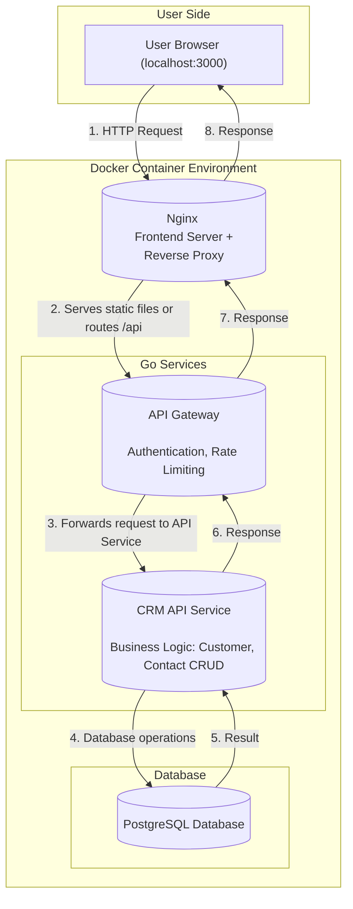

# Go CRM Microservices - API Documentation

## Table of Contents
1. [Overview](#overview)
2. [Architecture](#architecture)
3. [Authentication](#authentication)
4. [REST API Endpoints](#rest-api-endpoints)
5. [gRPC Services](#grpc-services)
6. [Frontend JavaScript API](#frontend-javascript-api)
7. [Database Schema](#database-schema)
8. [Error Handling](#error-handling)
9. [Rate Limiting](#rate-limiting)
10. [Deployment](#deployment)

## Overview

This is a production-ready Go-based microservices skeleton with a simple CRM application built on top of it. The system uses Docker for containerization and follows a layered microservices architecture.

### Technologies
- **Backend:** Go
- **Frontend:** HTML, CSS, Vanilla JavaScript (ES6 Modules)
- **Database:** PostgreSQL
- **API Type:** RESTful + gRPC (hybrid approach)
- **Containerization:** Docker & Docker Compose
- **Web Server:** Nginx (Frontend serving and API proxy)

## Architecture

The project follows a layered microservices architecture managed with Docker Compose. Each service runs in its own container and has specific responsibilities.



### Request Flow
1. **User Browser**: All interactions start through `localhost:3000`
2. **Nginx**: First service to receive requests
   - **Frontend Serving**: Serves HTML, JS, CSS files needed by the browser
   - **Reverse Proxy**: Routes requests starting with `/api/` to the API Gateway
3. **API Gateway**: Gateway to the outside world, currently forwards requests directly to the API service
4. **CRM API Service**: Main service containing the application's business logic
5. **PostgreSQL**: Database where all data (`users`, `customers`, `contacts`) is stored

## Authentication

The system uses JWT (JSON Web Tokens) for authentication.

### Login Endpoint

**POST** `/api/login`

Authenticates a user and returns a JWT token.

#### Request Body
```json
{
  "email": "demo@example.com",
  "password": "demo123"
}
```

#### Response
```json
{
  "token": "eyJhbGciOiJIUzI1NiIsInR5cCI6IkpXVCJ9..."
}
```

#### Example Usage
```javascript
const response = await fetch('/api/login', {
  method: 'POST',
  headers: { 'Content-Type': 'application/json' },
  body: JSON.stringify({ 
    email: 'demo@example.com', 
    password: 'demo123' 
  })
});
const data = await response.json();
localStorage.setItem('token', data.token);
```

### JWT Middleware

All protected endpoints require a valid JWT token in the Authorization header:

```
Authorization: Bearer <jwt_token>
```

**Token Expiration**: 24 hours

## REST API Endpoints

### Customer Management

#### Get All Customers
**GET** `/api/customers`

Returns a list of all customers.

**Headers Required**: `Authorization: Bearer <token>`

**Response**:
```json
[
  {
    "id": 1,
    "name": "John Doe",
    "email": "john@example.com",
    "phone": "+1234567890",
    "created_at": "2024-01-15T10:30:00Z"
  }
]
```

#### Create Customer
**POST** `/api/customers`

Creates a new customer.

**Headers Required**: 
- `Authorization: Bearer <token>`
- `Content-Type: application/json`

**Request Body**:
```json
{
  "name": "Jane Smith",
  "email": "jane@example.com",
  "phone": "+0987654321"
}
```

**Response** (201 Created):
```json
{
  "id": 2,
  "name": "Jane Smith",
  "email": "jane@example.com",
  "phone": "+0987654321",
  "created_at": "2024-01-15T11:00:00Z"
}
```

#### Update Customer
**PUT** `/api/customers/{id}`

Updates an existing customer.

**Headers Required**: 
- `Authorization: Bearer <token>`
- `Content-Type: application/json`

**Request Body**:
```json
{
  "name": "Jane Smith Updated",
  "email": "jane.updated@example.com",
  "phone": "+1111111111"
}
```

**Response**:
```json
{
  "id": 2,
  "name": "Jane Smith Updated",
  "email": "jane.updated@example.com",
  "phone": "+1111111111"
}
```

#### Delete Customer
**DELETE** `/api/customers/{id}`

Deletes a customer and all associated contacts.

**Headers Required**: `Authorization: Bearer <token>`

**Response**: 204 No Content

### Contact Management

#### Get All Contacts
**GET** `/api/contacts`

Returns a list of all contacts with customer information.

**Headers Required**: `Authorization: Bearer <token>`

**Response**:
```json
[
  {
    "id": 1,
    "customer_name": "John Doe",
    "message": "Follow up on proposal",
    "date": "2024-01-15"
  }
]
```

#### Create Contact
**POST** `/api/contacts`

Creates a new contact for a customer.

**Headers Required**: 
- `Authorization: Bearer <token>`
- `Content-Type: application/json`

**Request Body**:
```json
{
  "customer_id": 1,
  "message": "Customer interested in premium package"
}
```

**Response** (201 Created):
```json
{
  "id": 2,
  "customer_name": "John Doe",
  "message": "Customer interested in premium package",
  "date": "2024-01-15"
}
```

## gRPC Services

The system is prepared for gRPC communication between services. The following service is defined in `proto/user.proto`:

### UserService

#### CreateUser
```protobuf
rpc CreateUser (CreateUserRequest) returns (UserResponse);
```

**Request**:
```protobuf
message CreateUserRequest {
  string name = 1;
  string email = 2;
  string role = 3;
}
```

**Response**:
```protobuf
message UserResponse {
  User user = 1;
}

message User {
  string id = 1;
  string name = 2;
  string email = 3;
  string role = 4;
}
```

#### GetUser
```protobuf
rpc GetUser (GetUserRequest) returns (UserResponse);
```

**Request**:
```protobuf
message GetUserRequest {
  string id = 1;
}
```

#### UpdateUser
```protobuf
rpc UpdateUser (UpdateUserRequest) returns (UserResponse);
```

**Request**:
```protobuf
message UpdateUserRequest {
  string id = 1;
  string name = 2;
  string email = 3;
  string role = 4;
}
```

#### DeleteUser
```protobuf
rpc DeleteUser (DeleteUserRequest) returns (DeleteUserResponse);
```

**Request**:
```protobuf
message DeleteUserRequest {
  string id = 1;
}
```

**Response**:
```protobuf
message DeleteUserResponse {
  bool success = 1;
}
```

#### ListUsers
```protobuf
rpc ListUsers (ListUsersRequest) returns (ListUsersResponse);
```

**Request**:
```protobuf
message ListUsersRequest {
  int32 page = 1;
  int32 page_size = 2;
}
```

**Response**:
```protobuf
message ListUsersResponse {
  repeated User users = 1;
  int32 total = 2;
}
```

## Frontend JavaScript API

The frontend provides a JavaScript API module (`public/js/api.js`) for easy interaction with the backend.

### API Configuration

**Base URL**: `/api`

**Authentication**: Automatically includes JWT token from localStorage

### Customer Operations

#### getCustomers()
Returns all customers.

```javascript
import { getCustomers } from './api.js';

try {
  const customers = await getCustomers();
  console.log(customers);
} catch (error) {
  console.error('Error fetching customers:', error);
}
```

#### addCustomer(customer)
Creates a new customer.

```javascript
import { addCustomer } from './api.js';

const newCustomer = {
  name: 'John Doe',
  email: 'john@example.com',
  phone: '+1234567890'
};

try {
  const createdCustomer = await addCustomer(newCustomer);
  console.log('Customer created:', createdCustomer);
} catch (error) {
  console.error('Error creating customer:', error);
}
```

#### updateCustomer(id, customer)
Updates an existing customer.

```javascript
import { updateCustomer } from './api.js';

const updatedData = {
  name: 'John Doe Updated',
  email: 'john.updated@example.com',
  phone: '+1111111111'
};

try {
  const updatedCustomer = await updateCustomer(1, updatedData);
  console.log('Customer updated:', updatedCustomer);
} catch (error) {
  console.error('Error updating customer:', error);
}
```

#### deleteCustomer(id)
Deletes a customer.

```javascript
import { deleteCustomer } from './api.js';

try {
  await deleteCustomer(1);
  console.log('Customer deleted successfully');
} catch (error) {
  console.error('Error deleting customer:', error);
}
```

### Contact Operations

#### getContacts()
Returns all contacts.

```javascript
import { getContacts } from './api.js';

try {
  const contacts = await getContacts();
  console.log(contacts);
} catch (error) {
  console.error('Error fetching contacts:', error);
}
```

#### addContact(data)
Creates a new contact.

```javascript
import { addContact } from './api.js';

const newContact = {
  customer_id: 1,
  message: 'Customer interested in premium package'
};

try {
  const createdContact = await addContact(newContact);
  console.log('Contact created:', createdContact);
} catch (error) {
  console.error('Error creating contact:', error);
}
```

### Authentication

#### Login
```javascript
// From login.js
const response = await fetch('/api/login', {
  method: 'POST',
  headers: { 'Content-Type': 'application/json' },
  body: JSON.stringify({ email, password })
});

if (response.ok) {
  const data = await response.json();
  localStorage.setItem('token', data.token);
  window.location.href = 'dashboard.html';
}
```

## Database Schema

### Users Table
```sql
CREATE TABLE users (
  id SERIAL PRIMARY KEY,
  name VARCHAR(255) NOT NULL,
  email VARCHAR(255) UNIQUE NOT NULL,
  password_hash VARCHAR(255) NOT NULL,
  created_at TIMESTAMP DEFAULT now()
);
```

### Customers Table
```sql
CREATE TABLE customers (
  id SERIAL PRIMARY KEY,
  name VARCHAR(255) NOT NULL,
  email VARCHAR(255) UNIQUE NOT NULL,
  phone VARCHAR(50),
  created_at TIMESTAMP WITH TIME ZONE DEFAULT CURRENT_TIMESTAMP
);
```

### Contacts Table
```sql
CREATE TABLE contacts (
    id SERIAL PRIMARY KEY,
    customer_id INTEGER NOT NULL,
    message TEXT NOT NULL,
    created_at TIMESTAMP WITH TIME ZONE DEFAULT CURRENT_TIMESTAMP,
    CONSTRAINT fk_customer
        FOREIGN KEY(customer_id) 
        REFERENCES customers(id)
        ON DELETE CASCADE
);
```

## Error Handling

### HTTP Status Codes

- **200 OK**: Request successful
- **201 Created**: Resource created successfully
- **204 No Content**: Request successful, no content to return
- **400 Bad Request**: Invalid request data
- **401 Unauthorized**: Authentication required or failed
- **403 Forbidden**: IP not allowed (Gateway)
- **404 Not Found**: Resource not found
- **405 Method Not Allowed**: HTTP method not supported
- **429 Too Many Requests**: Rate limit exceeded
- **500 Internal Server Error**: Server error

### Error Response Format
```json
{
  "message": "Error description"
}
```

### JavaScript Error Handling
```javascript
try {
  const response = await apiRequest('/customers');
} catch (error) {
  console.error('API Error:', error.message);
  // Handle specific error types
  if (error.message.includes('401')) {
    // Redirect to login
    window.location.href = 'index.html';
  }
}
```

## Rate Limiting

The API Gateway implements rate limiting with the following characteristics:

- **Limit**: 10 requests per minute per IP
- **Scope**: Per IP address
- **Reset**: Every minute
- **Response**: 429 Too Many Requests when limit exceeded

### Allowlist IPs
Currently, only these IPs are allowed:
- `127.0.0.1` (localhost)
- `::1` (localhost IPv6)

## Deployment

### Quick Start with Docker

1. **Start the system**:
   ```bash
   make docker-up
   ```

2. **Access the application**:
   - URL: http://localhost:3000
   - Email: `demo@example.com`
   - Password: `demo123`

3. **Stop the system**:
   ```bash
   make docker-down
   ```

### Environment Variables

#### API Service
- `DB_HOST`: Database host (default: localhost)
- `DB_PORT`: Database port (default: 5432)
- `DB_USER`: Database user (default: user)
- `DB_PASSWORD`: Database password (default: pass)
- `DB_NAME`: Database name (default: users)
- `PORT`: API service port (default: 8085)

#### Gateway Service
- Default port: 8080

### Docker Services

- **nginx**: Frontend server and reverse proxy (port 3000)
- **gateway**: API Gateway (port 8080)
- **api**: CRM API Service (port 8085)
- **postgres**: PostgreSQL database (port 5432)

### Database Migrations

Migrations are automatically applied when starting the system with `make docker-up`. New migrations should be added to the `migrations/` directory in the format `[version]_name.up.sql`.

## Security Considerations

1. **JWT Secret**: Currently hardcoded, should be moved to environment variables
2. **Password Hashing**: Demo uses plain text comparison, production should use bcrypt
3. **HTTPS**: Production deployment should use HTTPS
4. **CORS**: Configure CORS policies for production
5. **Input Validation**: Implement comprehensive input validation
6. **SQL Injection**: Use parameterized queries (already implemented)

## Monitoring and Health Checks

### Health Check Endpoint
**GET** `/healthz`

Returns "ok" if the service is healthy.

```bash
curl http://localhost:8080/healthz
# Response: ok
```

## Future Enhancements

1. **gRPC Implementation**: Complete the gRPC service implementation
2. **Database Replication**: Implement read/write separation
3. **Caching**: Add Redis for caching
4. **Logging**: Implement structured logging
5. **Metrics**: Add Prometheus metrics
6. **Tracing**: Implement distributed tracing
7. **API Versioning**: Add API versioning support
8. **Documentation**: Generate OpenAPI/Swagger documentation