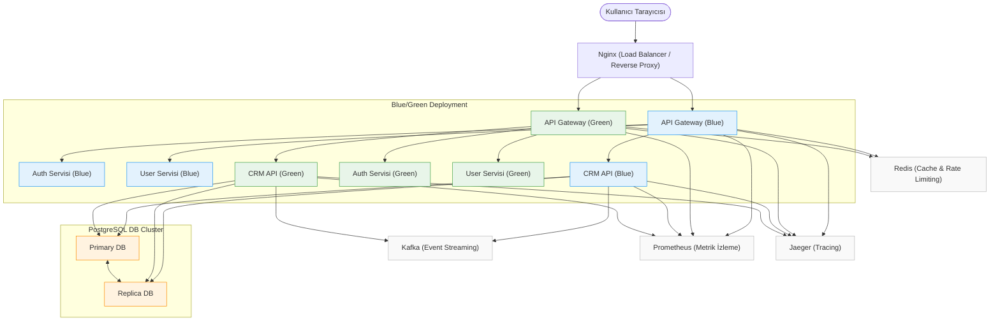

# Go Mikroservis Monorepo - CRM Örneği

Bu proje, kurumsal seviyede, ölçeklenebilir ve sürdürülebilir Go tabanlı bir mikroservis CRM mimarisi sunar. Modern DevOps ve yazılım mimarisi standartlarına uygun olarak, Docker Compose ile yönetilen, Blue/Green deployment, Nginx load balancer, primary/replica PostgreSQL, merkezi loglama, rate limiting, cache, event publish (Kafka), Prometheus/Jaeger izleme, JWT güvenlik, Swagger/OpenAPI ve CI/CD pipeline gibi ileri seviye özellikler içerir.

## Temel Teknolojiler
- Backend: Go (modüler mikroservis mimarisi)
- Frontend: HTML, CSS, Vanilla JavaScript (ES6 Modülleri)
- Veritabanı: PostgreSQL (Primary/Replica mimarisi destekli)
- API: RESTful + gRPC (hibrit iletişim)
- Containerization: Docker & Docker Compose
- Web Sunucusu: Nginx (Load balancer ve reverse proxy)
- İzleme: Prometheus, Jaeger
- Mesajlaşma: Kafka
- Cache & Rate Limiting: Redis
- Loglama: Logrus (JSON format, request-id/trace-id ile)
- Otomatik Migration: golang-migrate
- API Dokümantasyonu: Swagger/OpenAPI
- CI/CD: GitHub Actions

## Klasör Yapısı

- cmd/: Her mikroservis için ana uygulama giriş noktası (api, gateway, auth-svc, user-svc, notification-svc, audit-svc)
- pkg/: Ortak kütüphaneler, protolar, yardımcılar
- public/: Nginx tarafından sunulan frontend dosyaları
- migrations/: Otomatik migration için SQL şema dosyaları
- scripts/: Yardımcı scriptler (ör. seed.go)
- proto/: Protobuf tanımları
- tests/: Unit ve entegrasyon testleri
- deploy/: Docker Compose, Blue/Green, Keycloak, Kafka, Redis, Prometheus, Jaeger, Grafana, vs. için YAML dosyaları

## Mimarinin Temel Bileşenleri

- **Nginx Load Balancer:** Tüm HTTP trafiğini karşılar, frontend dosyalarını sunar ve API isteklerini ilgili servislere yönlendirir. Blue/Green deployment ve rolling update desteği sağlar.
- **API Gateway:** Kimlik doğrulama, rate limiting, merkezi loglama, izleme ve servisler arası yönlendirme işlevlerini üstlenir.
- **Mikroservisler:** Her iş alanı için ayrı Go servisi (ör. auth, user, notification, audit, crm-api). Her biri bağımsız ölçeklenebilir.
- **Veritabanı:** PostgreSQL primary/replica mimarisi ile yüksek erişilebilirlik ve performans. Okuma/yazma yükleri ayrılabilir.
- **Redis:** Rate limiting, cache ve oturum yönetimi için kullanılır.
- **Kafka:** Event publish/subscribe altyapısı ile servisler arası asenkron iletişim.
- **Prometheus & Jaeger:** İzleme, metrik toplama ve distributed tracing.
- **Loglama:** Tüm loglar JSON formatında, request-id/trace-id ile merkezi log sistemlerine uygun şekilde tutulur.
- **Swagger/OpenAPI:** Otomatik API dokümantasyonu.
- **CI/CD:** Otomatik test, build ve deployment pipeline’ı (GitHub Actions).

## Mimari Akış (Özet)

Aşağıda, Blue/Green deployment, Nginx load balancer, primary/replica PostgreSQL, tüm mikroservisler ve altyapı servislerini kapsayan profesyonel mimari şema yer almaktadır. Bu şema, canlı (Blue) ve yeni versiyon (Green) ortamlarının paralel çalışmasını, Nginx’in trafiği nasıl yönlendirdiğini ve tüm veri yollarını detaylı şekilde gösterir.



Kullanıcı → Nginx (Load Balancer) → API Gateway → Mikroservisler → PostgreSQL/Redis/Kafka → Yanıt

- Blue/Green deployment ile kesintisiz güncelleme
- Nginx ile yük dengeleme ve SSL sonlandırma
- API Gateway’de JWT doğrulama, rate limiting, merkezi loglama
- Mikroservisler arası gRPC ve event publish (Kafka)
- PostgreSQL primary/replica ile yüksek erişilebilirlik
- Redis ile cache ve rate limiting
- Prometheus/Jaeger ile izleme ve tracing

## Hızlı Başlangıç

**Gereksinimler:**
- Docker
- Docker Compose
- make (Windows için: choco install make)

### 1. Tüm Sistemi Başlatmak
Ana dizinde:
```
make docker-up
```
- Tüm servisler (Nginx, API Gateway, mikroservisler, PostgreSQL, Redis, Kafka, Prometheus, Jaeger) başlatılır.
- Migration’lar otomatik uygulanır, örnek kullanıcı eklenir.

### 2. Uygulamayı Kullanmak
Tarayıcıda http://localhost:3000 adresini açın.
- Giriş: demo@example.com / demo123
- Müşteri ekleme, listeleme, iletişim notu ekleme gibi işlemler yapılabilir.

### 3. Sistemi Durdurmak
```
make docker-down
```
Tüm konteynerler durur, veriler volume’da kalır.

## Migration Yönetimi
- SQL migration dosyalarını migrations/ klasörüne ekleyin.
- make docker-up ile migration’lar otomatik uygulanır.

## Production Mimarisi ve Özellikler

- Blue/Green deployment ile sıfır kesintiyle güncelleme
- Nginx ile yük dengeleme ve SSL
- PostgreSQL primary/replica ile yüksek erişilebilirlik
- Redis ile rate limiting ve cache
- Kafka ile event publish/subscribe
- JWT ile güvenli authentication
- Logrus ile merkezi, JSON formatında loglama
- Prometheus ve Jaeger ile izleme ve tracing
- Swagger/OpenAPI ile otomatik API dokümantasyonu
- CI/CD pipeline ile otomatik test, build ve deployment

## Katkı ve Geliştirme
- Kod ve dokümantasyonda ikon, emoji veya süsleme kullanılmaz.
- Tüm açıklamalar ve commit mesajları Türkçe olmalıdır.
- Her modül için test ve dokümantasyon zorunludur.

Daha fazla detay için:
- DEPLOYMENT_OPERATIONS_DOCUMENTATION.md
- API_DOCUMENTATION.md
- GO_FUNCTIONS_DOCUMENTATION.md
- FRONTEND_DOCUMENTATION.md

Her türlü katkı ve öneri için lütfen proje kurallarına uyunuz. 