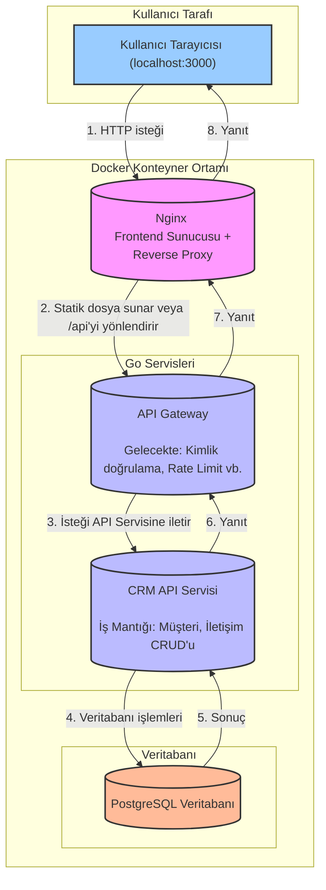

# Go Mikroservis Monorepo - CRM Örneği

Bu repo, üretim-hazır Go tabanlı bir mikroservis iskeleti ve bu iskelet üzerine inşa edilmiş, Docker ile çalışan basit bir CRM uygulaması sunar.

## Teknolojiler
- **Backend:** Go
- **Frontend:** HTML, CSS, Vanilla JavaScript (ES6 Modülleri)
- **Veritabanı:** PostgreSQL
- **API Tipi:** RESTful
- **Containerization:** Docker & Docker Compose
- **Web Server:** Nginx (Frontend sunumu ve API proxy için)

## Klasör Yapısı

- `cmd/`           : Her mikroservis için ana uygulama giriş noktası (`api`, `gateway` vb.)
- `pkg/`           : Servisler tarafından paylaşılan ortak kütüphaneler.
- `public/`        : Dockerize edilmiş, Nginx tarafından sunulan frontend dosyaları.
- `migrations/`    : `golang-migrate` uyumlu veritabanı şema dosyaları.
- `scripts/`       : Yardımcı scriptler (`docker-init.sh`, `seed.go`).
- `proto/`         : Protobuf tanımları.
- `tests/`         : Unit, integration ve E2E testleri.
- `docker-compose.yml`: Tüm servisleri (api, gateway, postgres, frontend) ayağa kaldıran ana dosya.
- `Dockerfile`     : Go servislerini derleyen ve çalıştıran dosya.
- `nginx.conf`     : Frontend'i sunan ve API gateway'e istekleri yönlendiren Nginx konfigürasyonu.
- `Makefile`       : Proje yönetimini kolaylaştıran komutlar (`docker-up`, `docker-down`).

## Proje Mimarisi

Proje, Docker Compose ile yönetilen katmanlı bir mikroservis mimarisine sahiptir. Her servis kendi konteynerinde çalışır ve belirli bir sorumluluğu yerine getirir. Temel istek akışı aşağıdaki gibidir:



### Akışın Açıklaması

1.  **Kullanıcı Tarayıcısı**: Tüm etkileşim `localhost:3000` üzerinden başlar.
2.  **Nginx**: Gelen istekleri ilk karşılayan servistir.
    *   **Frontend Sunumu**: Tarayıcının ihtiyaç duyduğu HTML, JS, CSS dosyalarını sunar.
    *   **Reverse Proxy**: Gelen istek `/api/` ile başlıyorsa, bu isteği `API Gateway`'e yönlendirir.
3.  **API Gateway**: Dış dünyaya açılan kapıdır. Şu anda istekleri doğrudan API servisine iletmektedir. Gelecekte kimlik doğrulama, hız limitleme gibi ortak kontroller burada yapılacaktır.
4.  **CRM API Servisi**: Uygulamanın iş mantığının bulunduğu ana servistir. Veritabanı ile konuşur, verileri işler ve sonuçları döndürür.
5.  **PostgreSQL**: Tüm verilerin (`users`, `customers`, `contacts`) saklandığı veritabanıdır. Docker Volume sayesinde veriler kalıcıdır.

### Hibrit API Yaklaşımı (REST & gRPC)

Bu mimari hibrit bir API modelini destekler:

-   **REST API (Dış İletişim):** Tarayıcı gibi dış istemciler, sistemi **REST** üzerinden (JSON ile) kullanır. Bu, evrensel ve kolay bir entegrasyon sağlar.
-   **gRPC (İç İletişim):** Servislerin kendi aralarındaki iletişim için **gRPC** kullanılması hedeflenmiştir. Bu, servisler arası daha yüksek performans ve verimlilik sağlar. Proje altyapısı bu yapıya hazırdır.

### Veritabanı Mimarisi (Replikasyon Hazırlığı)

-   **Mevcut Durum:** Geliştirme ortamında basitlik ve kaynak verimliliği için **tek bir PostgreSQL** veritabanı kullanılır. Tüm okuma ve yazma işlemleri bu veritabanına gider.
-   **Hedeflenen Mimari:** Proje, performansı artırmak için **Primary (Yazma)** ve **Read Replica (Okuma)** veritabanı modelini destekleyecek şekilde tasarlanmıştır. Bu sayede okuma ve yazma yükleri farklı sunuculara dağıtılabilir. Bu yapı, production ortamında kolayca aktif edilebilir.

## Hızlı Başlangıç (Docker ile)

Projenin tamamını (Backend, Frontend, Veritabanı) tek bir komutla ayağa kaldırabilirsiniz.

**Gereksinimler:**
- Docker
- Docker Compose
- `make` (Windows için `choco install make` veya [buradan](http://gnuwin32.sourceforge.net/packages/make.htm) kurulabilir)

### 1. Sistemi Başlatma
Proje ana dizinindeyken terminalde aşağıdaki komutu çalıştırın:
```sh
make docker-up
```
Bu komut arka planda şunları yapar:
- Gerekli Docker imajlarını indirir ve oluşturur (Go servisleri derlenir).
- PostgreSQL, API, Gateway ve Frontend servislerini başlatır.
- Konteyner ilk defa başlatıldığında veritabanı tablolarını (`users`, `customers`, `contacts`) otomatik olarak oluşturur (migration).
- `users` tablosuna örnek bir kullanıcı ekler (seeding).

### 2. Uygulamayı Kullanma
Tarayıcınızda **http://localhost:3000** adresini açın.

- **Giriş Bilgileri:**
  - **E-posta:** `demo@example.com`
  - **Şifre:** `demo123`

Giriş yaptıktan sonra müşteri ekleyebilir, listeleyebilir ve müşterilere iletişim notları ekleyebilirsiniz.

### 3. Sistemi Durdurma
Uygulamayı kapatmak için terminalde aşağıdaki komutu çalıştırın:
```sh
make docker-down
```
Bu komut, çalışan tüm konteynerleri durdurur ve siler. Veritabanı verileriniz bir Docker Volume'da saklandığı için kaybolmaz.

## Migration Yönetimi
Migration'lar (veritabanı şeması değişiklikleri) artık `make docker-up` komutu ile otomatik olarak uygulanmaktadır. Manuel bir işlem yapmanıza gerek yoktur. Yeni bir migration eklemek için `migrations/` dizinine `[versiyon]_adı.up.sql` formatında bir dosya eklemeniz yeterlidir. 